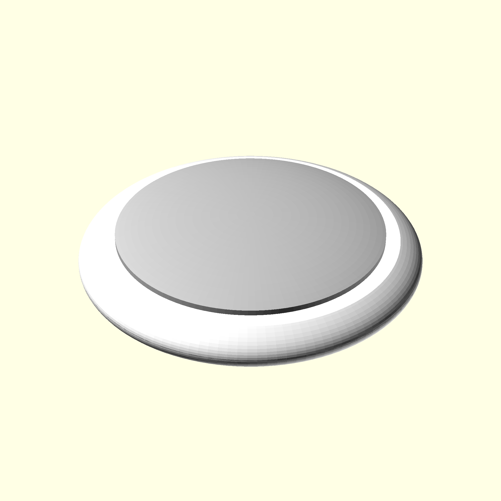

# airtag.scad

You can include this in your model with:

```
use <airtag.scad/airtag.scad>
```

There are 2 useful functions:

```
airtag_height();
airtag_diameter();
```

And of course a useful module:

```
airtag();
```


